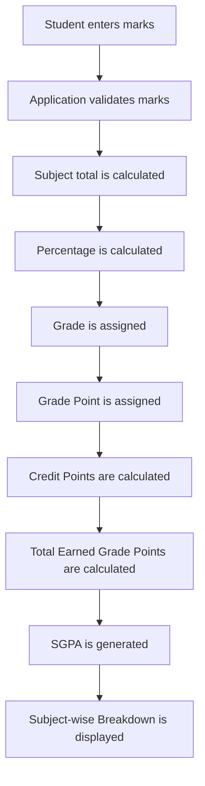
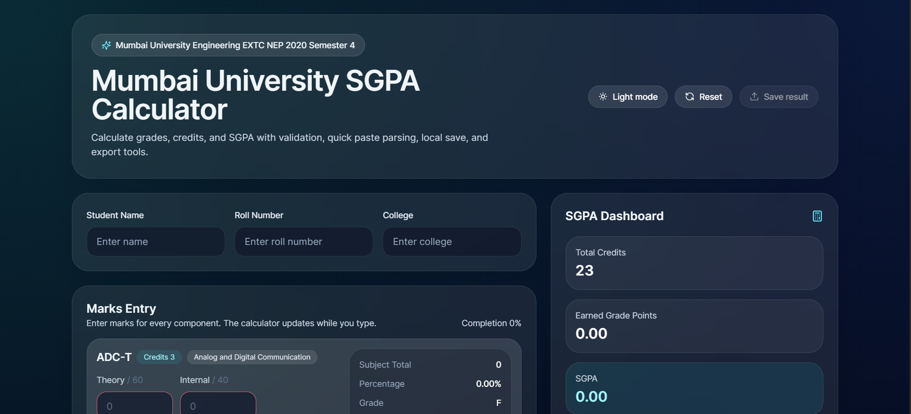
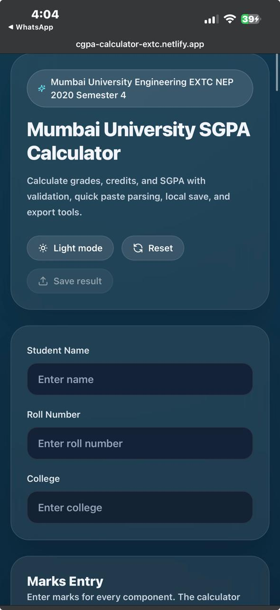

# Mumbai University SGPA Calculator (NEP 2020) – EXTC Semester IV

[](https://react.dev/)
[](https://vitejs.dev/)
[](https://tailwindcss.com/)
[](https://developer.mozilla.org/en-US/docs/Web/JavaScript)
[](https://cgpa-calculator-extc.netlify.app/)
[](LICENSE)
[](#installation)

**Live Demo:** https://cgpa-calculator-extc.netlify.app/

---

## Project Overview

Mumbai University SGPA Calculator (NEP 2020) – EXTC Semester IV is a modern web application built for Mumbai University Engineering students to calculate Semester SGPA accurately using the official NEP 2020 credit structure.

The project was built to solve a common academic problem: students often need to calculate SGPA manually from subject-wise marks, credit values, and grade points. That process is time-consuming and prone to mistakes, especially when theory, lab, term work, and oral components must all be combined correctly.

This calculator is intended for students who want a fast, clean, and reliable way to estimate semester performance. It helps users:

- Enter subject-wise marks with validation
- Automatically assign grades and grade points
- Calculate credit points and total earned grade points
- Generate final SGPA instantly
- Review a subject-wise breakdown for transparency

It is especially useful for EXTC students because the semester structure includes both theory and practical components, and the app keeps the full calculation process visible so students can understand how their SGPA is formed.

---

## Features

- [x] Real-time SGPA Calculation
- [x] Automatic Grade Assignment
- [x] Grade Point Calculation
- [x] Earned Grade Points (EGP)
- [x] Subject-wise Breakdown
- [x] Quick Paste Marks
- [x] PDF Export
- [x] Print Result
- [x] Copy Result
- [x] Share Result
- [x] Student Information
- [x] Responsive Design
- [x] Dark Mode
- [x] Mobile Friendly
- [x] Modern Dashboard
- [x] Input Validation

Additional quality-focused features include local save, recent calculations, smooth UI transitions, and a polished glassmorphism interface.

---

## Supported Curriculum

This calculator currently supports:

- Mumbai University
- NEP 2020
- Electronics & Telecommunication Engineering (EXTC)
- Semester IV
- Total Credits: 23

The application is designed with a modular structure, so it can be expanded later to support additional semesters, branches, and marking schemes without rewriting the entire workflow.

---

## Subject Credit Structure

| Subject | Credits |
| --- | ---: |
| ADC Theory | 3 |
| ADC Lab | 1 |
| COA Theory | 3 |
| COA Lab | 1 |
| Microcontroller Theory | 3 |
| Microcontroller Lab | 1 |
| Neural Network & Fuzzy Logic | 3 |
| Open Elective | 2 |
| Smart Embedded Systems | 2 |
| Business Development | 2 |
| Design Thinking | 2 |
| **Total Credits** | **23** |

This structure mirrors the semester credit distribution used by the calculator when computing the final SGPA.

---

## Mumbai University NEP 2020 Grading System

Every subject receives a grade based on its percentage score.

| Percentage | Grade | Grade Point |
| --- | --- | ---: |
| 90–100 | O | 10 |
| 80–89 | A+ | 9 |
| 70–79 | A | 8 |
| 60–69 | B+ | 7 |
| 55–59 | B | 6 |
| 50–54 | C | 5 |
| 40–49 | P | 4 |
| Below 40 | F | 0 |

The calculator uses this grading table consistently across all supported subjects, then converts each subject grade into grade points for SGPA computation.

---

## How the Calculator Works

The workflow is intentionally transparent so students can see exactly how the final SGPA is derived.



In practice, the app does the following:

1. The student enters marks for each subject component.
2. The application validates the inputs to prevent impossible values.
3. Each subject’s total marks are calculated from its components.
4. The percentage is derived from the subject’s maximum possible marks.
5. A grade and grade point are assigned using the official grading table.
6. Credit points are calculated by multiplying credits by the grade point.
7. All credit points are summed to obtain total earned grade points.
8. SGPA is calculated from total earned grade points and total semester credits.
9. A subject-wise breakdown table shows every calculation clearly.

---

## Calculation Methodology

The calculator follows standard credit-weighted SGPA logic.

### Percentage Formula

$$
	ext{Percentage} = \left(\frac{\text{Obtained Marks}}{\text{Maximum Marks}}\right) \times 100
$$

### Credit Points Formula

$$
	ext{Credit Points} = \text{Credits} \times \text{Grade Point}
$$

### Earned Grade Points

$$
	ext{Total EGP} = \sum (\text{Credits} \times \text{Grade Point})
$$

### SGPA Formula

$$
	ext{SGPA} = \frac{\text{Total EGP}}{\text{Total Semester Credits}}
$$

### Worked Example

If a subject has 64 marks out of 100, the percentage is 64%, which maps to grade B+ and grade point 7.

If the subject carries 3 credits:

$$
	ext{Credit Points} = 3 \times 7 = 21
$$

If the semester total earned grade points are 184 and the total semester credits are 23:

$$
	ext{SGPA} = \frac{184}{23} = 8.00
$$

This is why the app emphasizes both the final SGPA and the subject-wise breakdown, so students can verify each intermediate step.

---

## Subject Evaluation Pattern

Different subjects are evaluated using different combinations of theory and practical components.

### ADC Theory

- Theory
- Internal

### ADC Lab

- Term Work
- Oral

### COA Theory

- Theory
- Internal

### COA Lab

- Term Work
- Oral

### Microcontroller Theory

- Theory
- Internal

### Microcontroller Lab

- Term Work
- Oral

### NNFL

- Theory
- Internal
- Term Work

### Open Elective

- Theory
- Internal

### Smart Embedded Systems

- Term Work
- Oral

### Business Development

- Term Work

### Design Thinking

- Term Work

Some subjects contain only practical or term-work-based components because the semester curriculum treats them as skill-focused or lab-oriented courses. The calculator reflects that structure directly instead of forcing all subjects into a theory-only template.

---

## Technologies Used

- React — component-based UI for reusable calculator sections
- Vite — fast development and optimized production builds
- JavaScript — simple, accessible implementation without unnecessary complexity
- Tailwind CSS — responsive styling and consistent utility-based design
- Framer Motion — motion layer for richer transitions and future animation enhancements; the current build uses lightweight CSS animations for most effects
- React Icons — scalable social and action icons for the footer and interface
- html2canvas — supports DOM capture for export workflows
- jsPDF — generates downloadable PDF results

The current implementation focuses on lightweight, responsive UI motion and export functionality while keeping the codebase easy to maintain.

---

## Project Structure

```text
.
├── .github/
│   └── copilot-instructions.md   # Workspace instructions for future AI-assisted edits
├── src/
│   ├── App.jsx                   # Main application UI and page layout
│   ├── data/
│   │   └── subjects.js           # Subject definitions, credits, and grading scale
│   ├── lib/
│   │   ├── parser.js             # Quick Paste parsing logic
│   │   ├── sgpa.js               # Grade, SGPA, and breakdown calculations
│   │   └── storage.js            # Local storage helpers
│   ├── __tests__/                # Unit tests for core functionality
│   ├── main.jsx                  # React entry point
│   └── styles.css                # Global styles and shared components
├── index.html                    # Vite HTML entry file
├── package.json                  # Scripts and dependencies
├── tailwind.config.js            # Tailwind configuration
├── postcss.config.js             # PostCSS configuration
└── vite.config.js                # Vite build and test configuration
```

### Folder Notes

- `src/data` keeps all subject metadata in one place.
- `src/lib` contains the calculation and persistence logic.
- `src/__tests__` verifies grading boundaries, parser behavior, and SGPA math.
- `.github` contains project instructions that help keep future edits consistent.

---

## Installation

### 1. Clone the repository

```bash
git clone https://github.com/atharva-nagalkar/cgpa-calculator-EXTC-SEM-4.git
cd cgpa-calculator-EXTC-SEM-4
```

### 2. Install dependencies

```bash
npm install
```

### 3. Run the development server

```bash
npm run dev
```

### 4. Build the production version

```bash
npm run build
```

### 5. Preview the production build

```bash
npm run preview
```

---

## Screenshots

The project includes two ready-to-use UI screenshots in the `public` folder.

### Desktop View



### Mobile View



These images can be replaced later if you capture updated UI states, but the README is now configured to use the actual screenshots that ship with the project.

---

## Future Improvements

- CGPA Calculator
- Multiple Semester Support
- Multiple Branch Support
- Grace Marks Calculator
- Performance Analytics
- Result Prediction
- PDF Marksheet Upload
- Official Result Comparison
- Export to Excel

---

## FAQ

### How is SGPA calculated?

SGPA is calculated by converting each subject percentage into a grade, turning that grade into a grade point, multiplying by subject credits, and dividing the total earned grade points by the total semester credits.

### Why are Theory and Lab separated?

Theory and lab components are graded separately because Mumbai University assigns different evaluation patterns and credit weights to academic and practical work.

### Does this support all branches?

Not yet. This version is focused on EXTC Semester IV under NEP 2020, but the data-driven architecture makes future branch expansion possible.

### Can I calculate CGPA?

This version is designed for SGPA. A CGPA calculator can be added as a future enhancement.

### Is this an official Mumbai University website?

No. This is an independent student-built tool created for educational use.

### How accurate is the calculator?

The calculator is designed to match the official credit structure and grading scheme used for the supported semester. Students should still confirm final results with the university-issued marksheet.

---

## Disclaimer

This is an independent educational project developed for Mumbai University students.

The calculator is intended to help students estimate their SGPA using the applicable credit structure and grading scheme.

Students should always verify their official SGPA with the university-issued result.

---

## About the Developer

**Atharva Sanjay Nagalkar**

- Engineering Student
- KC College of Engineering & Management Studies & Research
- Mumbai University

### Passionate About

- Web Development
- Data Analytics
- Building practical tools

### Connect

- [LinkedIn](https://www.linkedin.com/in/atharva-nagalkar-55796a357/)
- [GitHub](https://github.com/atharva-nagalkar)
- [Email](mailto:hithisisnagalkaratharva@gmail.com)

---

## License

MIT License

---

If you find this project helpful, consider starring the repository and sharing it with other Mumbai University students.
